# BYEM GYM - Project Architecture & File Connections

This document provides a highly detailed visualization of the BYEM GYM Project structure. It illustrates how each file connects, imports, and interacts with other files ensuring the separation of concerns (Modularity).

## 🗺️ Visual Architecture Map

*(Tip: In VS Code, press `Ctrl+Shift+V` or click the "Open Preview" button in the top right to view this Mermaid graph visually!)*

```mermaid
graph TD
    %% ----------------------------------------------------
    %% STYLING (Optional for better view)
    %% ----------------------------------------------------
    classDef html fill:#e34f26,stroke:#fff,stroke-width:2px,color:#fff;
    classDef core fill:#f7df1e,stroke:#fff,stroke-width:2px,color:#000;
    classDef controller fill:#3178c6,stroke:#fff,stroke-width:2px,color:#fff;
    classDef service fill:#42b883,stroke:#fff,stroke-width:2px,color:#fff;
    classDef data fill:#5c2d91,stroke:#fff,stroke-width:2px,color:#fff;

    %% ----------------------------------------------------
    %% 5. DATA LAYER (Central Database Mock)
    %% ----------------------------------------------------
    subgraph Data [Data Layer]
        store[data/store.js]:::data
    end

    %% ----------------------------------------------------
    %% 4. SERVICES LAYER (Business Logic)
    %% ----------------------------------------------------
    subgraph Services [Business Logic / Services]
        authSrv[services/authService.js]:::service
        memSrv[services/membershipService.js]:::service
        bookSrv[services/bookingService.js]:::service
        toastSrv[services/toastService.js]:::service
    end

    %% Service -> Data Connections
    authSrv -->|Reads/Writes Users & Sessions| store
    memSrv -->|Reads/Writes Membership States| store
    bookSrv -->|Reads/Writes Classes & Booking Data| store

    %% ----------------------------------------------------
    %% 3. CORE & COMPONENTS (Global Scripts)
    %% ----------------------------------------------------
    subgraph Core [Global Core & Components]
        guard[core/guard.js]:::core
        app[core/app.js]:::core
        navbar[components/navbar.js]:::core
        footer[components/footer.js]:::core
    end

    %% Core Connections
    guard -.->|Validates Session| store
    app -->|Injects UI| navbar
    app -->|Injects UI| footer

    %% ----------------------------------------------------
    %% 2. PAGE CONTROLLERS (DOM Manipulation)
    %% ----------------------------------------------------
    subgraph Controllers [Page Controllers]
        regJS[pages/register.js]:::controller
        loginJS[pages/login.js]:::controller
        dashJS[pages/dashboard.js]:::controller
        adminJS[pages/admin.js]:::controller
        classesJS[pages/classes.js]:::controller
        payJS[pages/payment.js]:::controller
    end

    %% Controller -> Service Connections
    regJS -->|Creates User| authSrv
    regJS -->|Shows Notifications| toastSrv

    loginJS -->|Authenticates| authSrv
    loginJS -->|Shows Notifications| toastSrv

    dashJS -->|Gets Cur. User| authSrv
    dashJS -->|Gets Sub Details| memSrv
    dashJS -->|Gets User Bookings| bookSrv
    dashJS -->|Shows Notifications| toastSrv

    adminJS -->|Direct DB Crud| store
    adminJS -->|Shows Notifications| toastSrv

    classesJS -->|Gets Cur. User| authSrv
    classesJS -->|Books/Cancels| bookSrv
    classesJS -->|Shows Notifications| toastSrv

    payJS -->|Gets Cur. User| authSrv
    payJS -->|Upgrades Sub| memSrv
    payJS -->|Shows Notifications| toastSrv

    %% ----------------------------------------------------
    %% 1. HTML VIEWS (Entry Points)
    %% ----------------------------------------------------
    subgraph HTML [HTML Pages]
        h_reg[auth/register.html]:::html
        h_log[auth/login.html]:::html
        h_dash[dashboard/member.html]:::html
        h_adm[dashboard/admin.html]:::html
        h_cls[classes.html]:::html
        h_pay[payment.html]:::html
        h_pub[index, about, contact .html]:::html
    end

    %% HTML -> Script Inclusions (Which JS belongs to which HTML)
    h_reg ==>|Includes| guard
    h_reg ==>|Includes| app
    h_reg ==>|Includes| regJS

    h_log ==>|Includes| guard
    h_log ==>|Includes| app
    h_log ==>|Includes| loginJS

    h_dash ==>|Includes| guard
    h_dash ==>|Includes| app
    h_dash ==>|Includes| dashJS

    h_adm ==>|Includes| guard
    h_adm ==>|Includes| app
    h_adm ==>|Includes| adminJS

    h_cls ==>|Includes| app
    h_cls ==>|Includes| classesJS

    h_pay ==>|Includes| guard
    h_pay ==>|Includes| app
    h_pay ==>|Includes| payJS

    h_pub ==>|Includes| app
```

## 📑 File Dependencies Breakdown

### 1. The Database
*   **`data/store.js`**: The heart of the application. It acts as our DB mock using `localStorage`.
    *   *Imported by:* `authService.js`, `membershipService.js`, `bookingService.js`, `guard.js`, `admin.js`.

### 2. The Services (Backend Mock APIs)
*   **`services/authService.js`**: Handles login math, password hashing, and returns Session states.
*   **`services/membershipService.js`**: Contains static plan prices data and the logic to activate memberships.
*   **`services/bookingService.js`**: Validates class capacities and prevents duplicate user bookings.
*   **`services/toastService.js`**: Purely a UI service to push non-blocking notifications. Required by almost all UI controllers.

### 3. Core Protection & Injection
*   **`core/guard.js`**: Imported inside the `<head>` of HTML files. Immediately checks the `window.location` against `store.js` session data. If unauthorized, it kicks the user out before the page renders.
*   **`core/app.js`**: Automatically loads `navbar.js` and `footer.js` strings into the DOM placeholders (`#navbar-placeholder`).

### 4. Page Scripts (Event Listeners)
*   **`js/pages/*.js`**: These files directly listen to HTML click/submit events (`addEventListener`). They grab the user input, pass it to the respective `Service`, and then use `toastService` to show the result, finally redirecting if needed.
